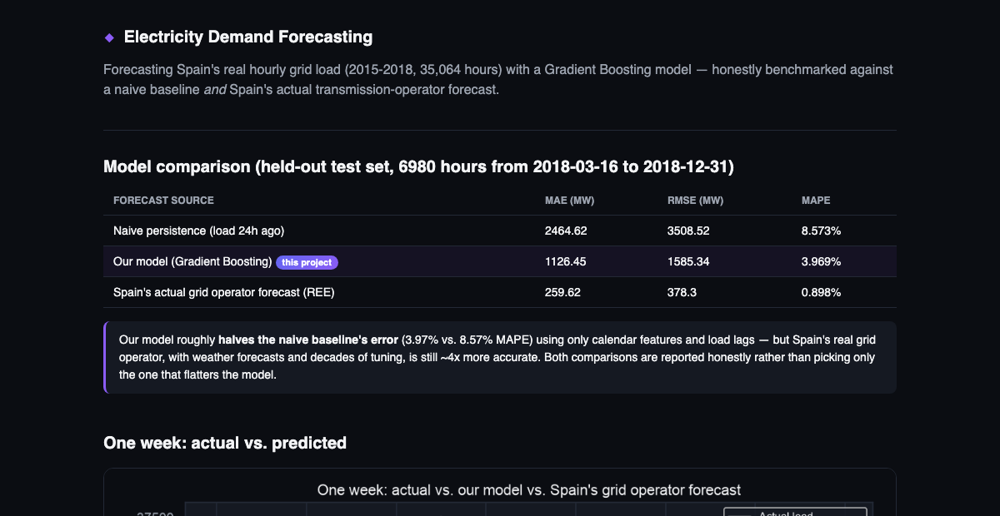

# Electricity Demand Forecasting — Documentation

## Problem Statement

A time-series forecasting project on Spain's real hourly electrical grid
load (2015–2018, 35,064 hours) — and the part that makes it more than a
typical forecasting demo: the model is benchmarked not just against a naive
baseline, but against **Spain's actual transmission-system-operator (REE)
day-ahead forecast**, which is already in the dataset. That's a real,
professionally-produced forecast to compare against, not a synthetic one.



## What It Does / How It Works

## The honest result

| Forecast source | MAE (MW) | RMSE (MW) | MAPE |
|---|---|---|---|
| Naive persistence (load 24h ago) | 2,464.62 | 3,508.52 | 8.573% |
| **Our model (Gradient Boosting)** | **1,126.45** | **1,585.34** | **3.969%** |
| Spain's actual grid operator forecast (REE) | 259.62 | 378.30 | 0.898% |

Our model — trained only on calendar features (hour, day-of-week, month) and
load lags/rolling means, no weather data — **roughly halves the naive
baseline's error**. But Spain's real grid operator, which has access to
weather forecasts and years of domain-specific tuning, is still about **4x
more accurate**. Both numbers are reported side by side rather than
comparing only against the baseline that makes the model look best.

## Why this matters more than a single accuracy number

Anyone can report "my model gets X% MAPE." Whether that's *good* depends
entirely on what it's being compared to. This project makes that comparison
concrete and real:
- Beats a naive baseline decisively → the model is learning genuine
  structure (daily/weekly cycles, recent load momentum).
- Loses to a domain-specialist forecast with more inputs → an honest
  ceiling, and a plausible explanation (no weather data) rather than a
  vague excuse.

## Tech stack

| Layer | Tech |
|---|---|
| Modeling | scikit-learn `GradientBoostingRegressor` |
| Feature engineering | pandas (lag features, rolling means, calendar features) |
| Charts | matplotlib + seaborn (static), vanilla Canvas (live demo chart) |
| Serving | Flask |

## Quickstart

```bash
python3 -m venv .venv && source .venv/bin/activate
pip install -r requirements.txt

# model + charts are already generated and committed - to regenerate:
python3 src/train.py
python3 src/charts.py

python3 app.py
# open http://127.0.0.1:5300
```

## Project structure

```
energy-demand-forecasting/
├── app.py                  # Flask dashboard + /api/sample-day
├── src/
│   ├── features.py          # lag/rolling/calendar feature engineering
│   ├── train.py              # trains model, benchmarks vs. naive + grid operator
│   ├── charts.py              # generates static PNG charts
│   └── download_data.py       # optional: regenerate data/ from Hugging Face
├── data/                    # bundled real Spain ENTSO-E hourly grid data
├── model/                   # trained model, metrics.json, test_predictions.csv
├── static/, templates/     # UI
└── docs/
    ├── TECHNICAL.md
    └── screenshots/
```

## Docs

Full methodology — feature design, the time-ordered split rationale, and
the operator-forecast benchmark — in [`docs/TECHNICAL.md`](TECHNICAL.md).


## How to Run

See the project README's setup/installation instructions.

## Screenshots

Real, working-application screenshots are in [`docs/screenshots/`](screenshots/) in this repository (also embedded inline in the main README).
